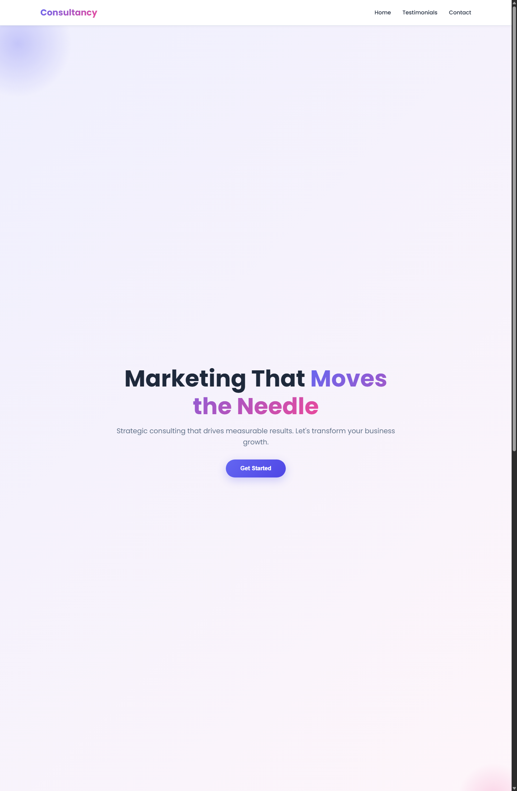

# Marketing Consultancy Website

A single-page, vanilla HTML/CSS/JS marketing consultancy site with a futuristic "signal readout" aesthetic: hero, services, process, testimonials, a gated lead-magnet checklist, and a FormSubmit-powered enquiry form.

**Live site**: https://contentflowdigital321-cell.github.io/marketingagency/

## Structure
- `index.html` — everything: markup, CSS (in a `<style>` block), and JS (in a `<script>` block).
- `growth-audit-checklist.html` — the lead magnet: a printable "10-Point Growth Audit Checklist," revealed as an instant download once the enquiry form is submitted.
- `assets/preview.png` — screenshot of the hero section for this README (regenerate after major visual changes).

## Design system
Dark "signal readout" theme built for this redesign via the `frontend-design` skill:
- **Color**: near-black void (`#05070d`) with two accents — cyan (`#43e7d6`) for data/trust, violet (`#8c6bff`) and amber (`#ffb454`) for CTAs.
- **Type**: Space Grotesk (display), Inter (body), IBM Plex Mono (eyebrows, labels, stats).
- **Signature element**: an animated SVG "signal" line + count-up stat readout in the hero, tying directly to the "moves the needle" tagline.
- Respects `prefers-reduced-motion` throughout (count-up, scroll-reveal, signal-line draw).

## Lead magnet
Per the `lead-magnets` skill: the enquiry form is reframed around claiming a free **10-Point Growth Audit Checklist** (`growth-audit-checklist.html`), not a generic "send us a message" form.
- All four fields (Name, Email, Company, "biggest challenge") are required before the form can submit.
- On successful submit, a "Download the Checklist" button reveals immediately (instant access), FormSubmit's `_autoresponse` field sends a confirmation email, and the browser speaks a thank-you message via the Web Speech API (`SpeechSynthesisUtterance`).
- Three-item FAQ (native `
`, no JS) addresses the obvious objections right next to the form.

## SEO
Per the `seo-audit` skill: unique title/meta description, canonical URL, Open Graph + Twitter Card tags, `ProfessionalService` JSON-LD, single H1 with logical H2/H3 hierarchy, semantic `<main>`/`<nav>`/`<footer>` landmarks, and an inline SVG favicon (no extra HTTP request). The checklist page is `noindex` since it's a delivery page, not a page meant to rank.

## Spec checklist (verified)
- **Hero**: gradient + grid background, animated signal-line SVG, count-up stat readout (40% qualified leads, 4-step process, 48h response), dual CTA, sticky nav with a mobile hamburger menu.
- **Services / Process**: four service cards ("What We Do") and a real four-step sequence ("How We Work") — numbered only where order is genuinely meaningful.
- **Testimonials**: "What Our Clients Say" section, 3-card responsive grid, quote + name + company/role + avatar.
- **Lead magnet + enquiry form**: two-column layout (pitch/preview/FAQ + sticky form). Submits via `fetch()` as JSON to `https://formsubmit.co/ajax/contentflowdigital321@gmail.com` with `Accept: application/json`. Client-side validation for required fields + email format, "Sending…" state, success/error messaging, instant checklist-download reveal on success.
- **General**: mobile-first and responsive, visible keyboard focus, skip-to-content link, `prefers-reduced-motion` support, cohesive design tokens via CSS custom properties.

## Enquiry form delivery
The form posts to [FormSubmit](https://formsubmit.co), targeting `contentflowdigital321@gmail.com` directly — no account or form ID needed. The **first** submission ever sent to a given address triggers a one-time confirmation email from FormSubmit that must be clicked to activate delivery; submissions before that point are accepted by the API but not forwarded. `_autoresponse` sends a short confirmation back to the submitter.

## Verification notes
Verified in a real browser (Playwright) at desktop and mobile viewports: hero readout animation, scroll-reveal, mobile hamburger menu, empty-field/invalid-email form validation, and the checklist page. Found and fixed one real bug during testing: the mobile nav dropdown's near-opaque background (`rgba(..., 0.98)`) let page content bleed through underneath it — a Chromium `backdrop-filter` compositing quirk from the sticky nav's `blur(14px)`. Fixed by making the dropdown fully opaque (solid color, no alpha) and adding `isolation: isolate`.
